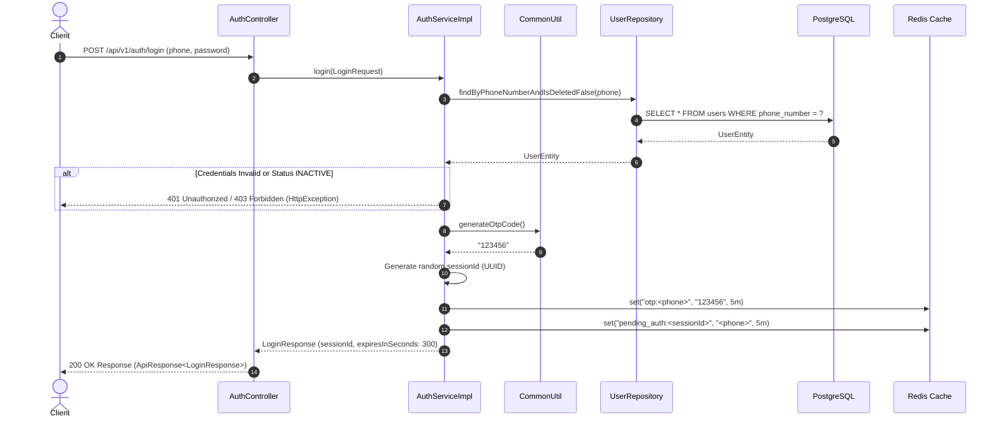
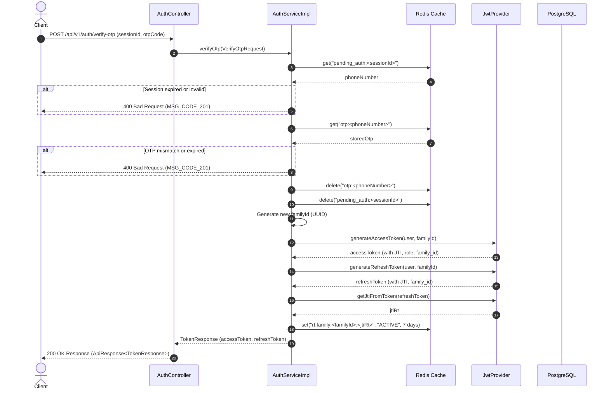
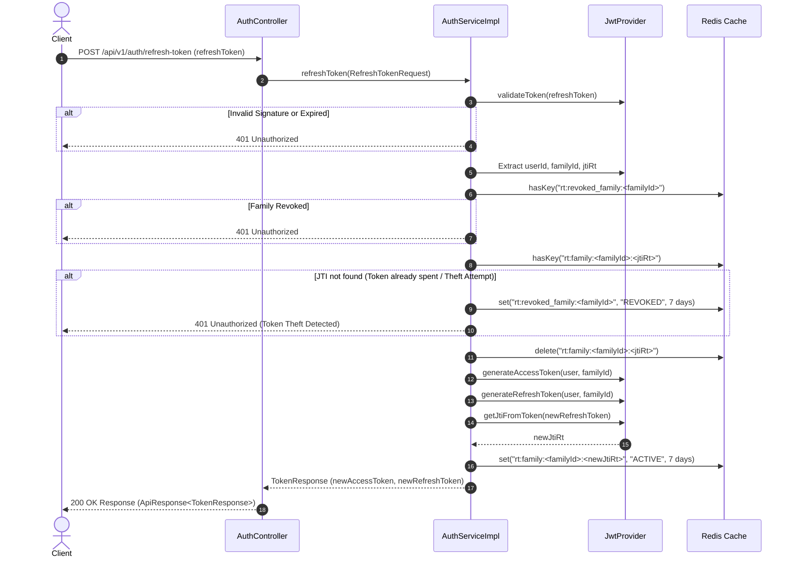
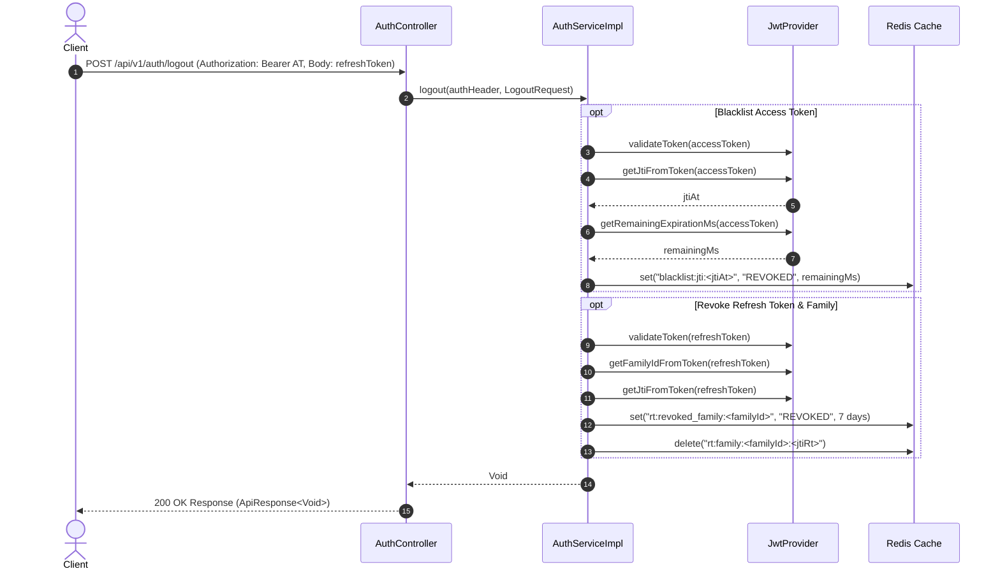
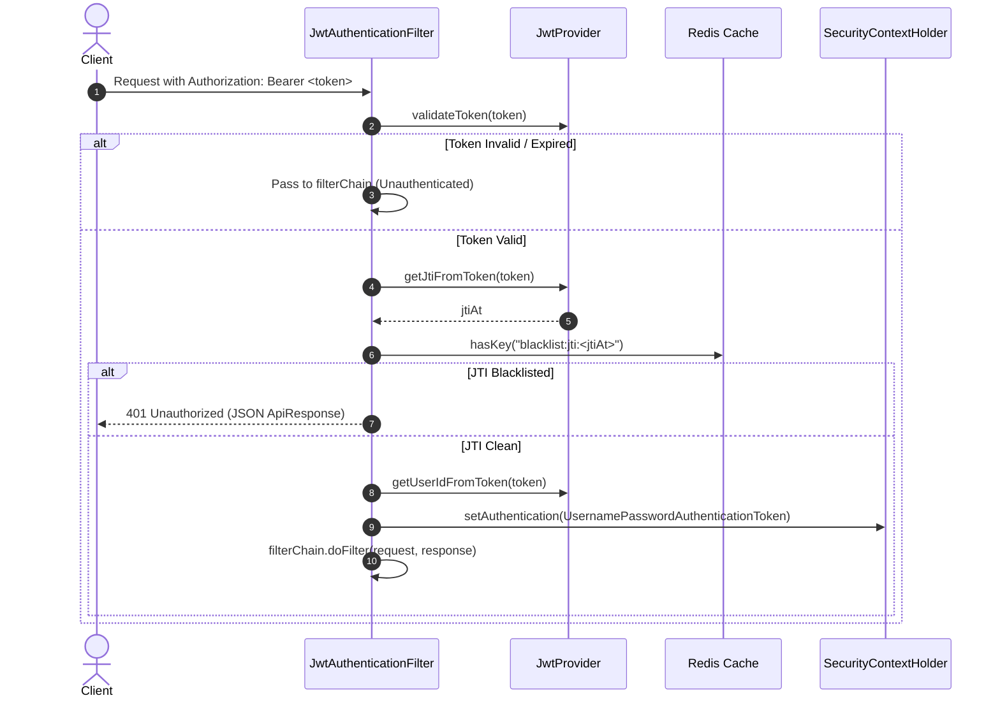

# Enterprise 2FA & Token Management Architecture Specification

## 1. Overview & Security Architecture

Tro Nhanh Backend implements an **Enterprise-Grade Two-Factor Authentication (2FA)** and **Token Management System** built on top of Spring Security 6, JWT, and Redis.

### Key Security Design Patterns

1. **Two-Factor Authentication (2FA)**:
   - **Step 1 (Credential Validation)**: Phone number + Password validation generates a 6-digit OTP code and a temporary session ID stored in Redis (TTL: 5 minutes).
   - **Step 2 (OTP Verification)**: Validates OTP against Redis, invalidates temporary credentials, and issues JWT Access & Refresh Token pair bound to a unique Token Family.
2. **JTI-based Instant Access Token Blacklisting**:
   - Access tokens contain a unique JWT ID (`jti`). Upon logout, the `jti` is stored in Redis (`blacklist:jti:<jti>`) with a TTL matching the token's remaining lifespan, ensuring instant stateless revocation.
3. **Token Family Rotation (Mitigating Refresh Token Theft)**:
   - Every Refresh Token belongs to a `family_id`.
   - When a Refresh Token is used, it is rotated (a new Refresh Token JTI is issued under the same `family_id`).
   - If an old/spent Refresh Token JTI is presented (Replay Attack), the system detects token theft and immediately revokes the **entire Token Family** (`rt:revoked_family:<family_id>`).
4. **Role-Based Access Control (RBAC)**:
   - Enforcing strict roles (`RoleName` Enum: `USER`, `ADMIN`).
   - Dynamic profile mapping via `UserHelper`.

---

## 2. Redis Key Structure & TTL Specifications

| Key Pattern | Data Type | Purpose | TTL |
| :--- | :--- | :--- | :--- |
| `otp:<phoneNumber>` | String | Stores 6-digit OTP verification code | 5 minutes (`OTP_TTL_MINUTES`) |
| `pending_auth:<sessionId>` | String | Maps temporary 2FA session to phone number | 5 minutes (`OTP_TTL_MINUTES`) |
| `rt:family:<familyId>:<jtiRt>` | String | Identifies active Refresh Token JTI within family | 7 days (`REFRESH_FAMILY_TTL_DAYS`) |
| `rt:revoked_family:<familyId>` | String | Marks entire Token Family as revoked upon theft/logout | 7 days (`REFRESH_FAMILY_TTL_DAYS`) |
| `blacklist:jti:<jtiAt>` | String | Blacklists Access Token JTI upon logout | Remaining AT lifespan (ms) |

---

## 3. Sequence Diagrams

### 3.1 Flow 1: Step 1 Login (`POST /api/v1/auth/login`)



---

### 3.2 Flow 2: Step 2 OTP Verification (`POST /api/v1/auth/verify-otp`)



---

### 3.3 Flow 3: Token Rotation (`POST /api/v1/auth/refresh-token`)



---

### 3.4 Flow 4: Enterprise Logout (`POST /api/v1/auth/logout`)



---

### 3.5 Flow 5: Security Filter Inspection (`JwtAuthenticationFilter`)



---

## 4. Components & Package Layout

```
com.tronhanh
├── config
│   └── SecurityConfig.java         # Public endpoint matchers & Filter Chain setup
├── constant
│   └── AppConstant.java            # PUBLIC_ENDPOINTS, Redis prefixes & TTLs
├── controller
│   └── AuthController.java         # Authentication REST endpoints
├── dto
│   ├── request
│   │   └── auth                    # LoginRequest, VerifyOtpRequest, RefreshTokenRequest, LogoutRequest
│   └── response
│       └── auth                    # LoginResponse, TokenResponse, UserProfileResponse
├── entity
│   ├── RoleEntity.java             # System roles with RoleName enum
│   └── UserEntity.java             # User entity
├── enums
│   └── RoleName.java               # USER, ADMIN enum
├── helper
│   └── UserHelper.java             # Entity to DTO mapping helper
├── security
│   ├── JwtAuthenticationFilter.java# Blacklist checking filter
│   └── JwtProvider.java            # Token generation & verification
└── service
    ├── AuthService.java            # Service contract
    └── impl
        └── AuthServiceImpl.java    # 2FA logic, Redis token rotation & revocation
```
